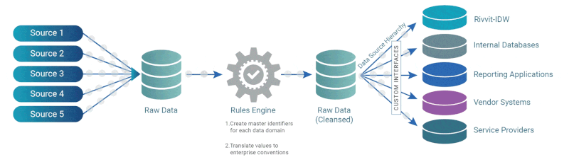
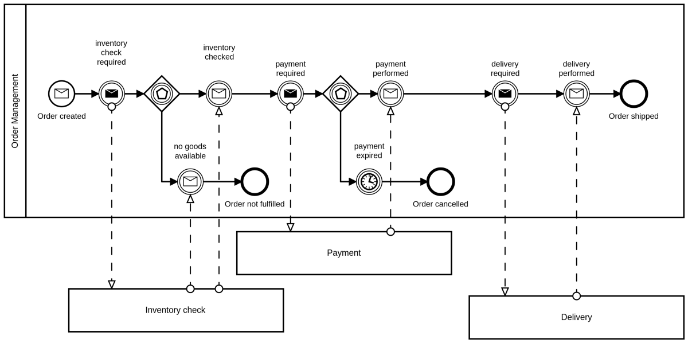

## Modern Open-Source Big Data Solution for 4G, 5G Networks (3GPP XML) 
My role as the solution designer / associate technical lead was to analyze the existing system pain points and design a robust open source data solution, ensuring efficient parallel data ingestion and processing. Through close collaboration with client-side solution designers, I designed and implemented a tailored architecture with open-source big data tools that met their parallelization, multiprocessing requirements. My significant architecture designing & scala development contributions to data collection, preparation, storage, KPI calculation, analytics, visualization, and governance stages were integral to the project's success.
- 
- Tags: Big Data
- Badges:
  - SCALA [red]
  - SPARK [red]
  - KAFKA [red]
  - HADOOP[red]
  - NIFI [red]
  - K8s [red]
- Buttons:
  - source-code []

## Business Process Modeling : Camunda Utility Services
Camunda 7.X to 7.X version JavaEE migration, Camunda Distributed Tracing Utility Service, process variable Mapper.
- 
- Tags: Process Automation
- Badges:
  - JAVAEE [red]
  - CAMUNDA [red]
  - REACTJS [red]
  - JBOSS [red]
  - APACHE KAFKA [red]
- Buttons:
  - source-code [https://github.com/ashenjy/camunda-bpm-run]